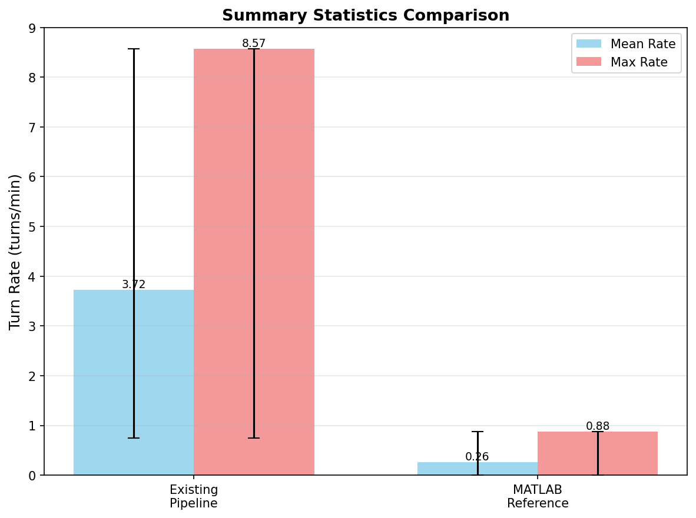
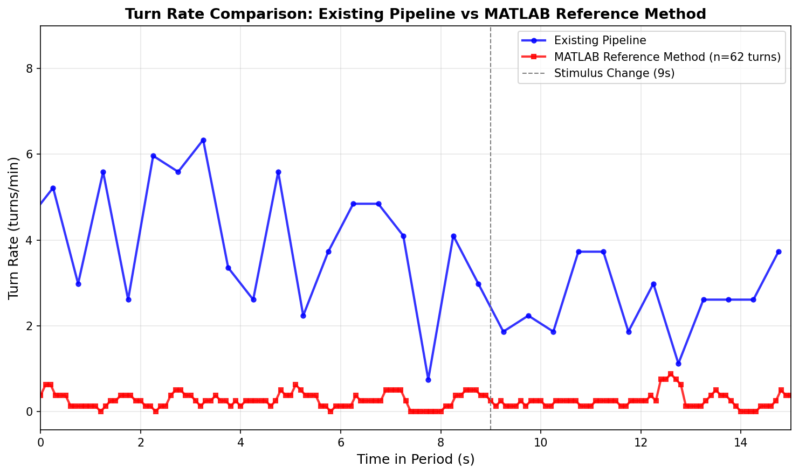
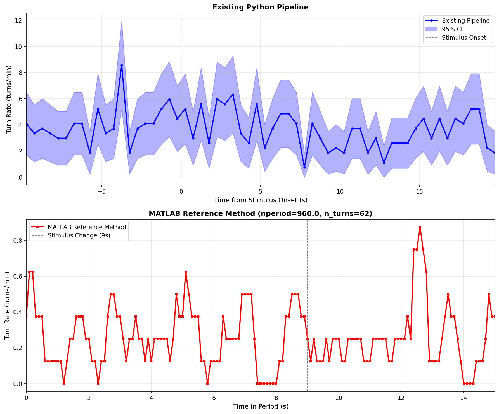

# INDYsim

**Stimulus-Driven Behavioral Modeling of Drosophila Larvae**

[](https://github.com/GilRaitses/INDYsim)
[](https://gilraitses.github.io/INDYsim/)

This project develops event-hazard models for larval behavioral responses to time-varying LED stimuli using generalized linear models with temporal kernels. The simulation framework generates trajectories under factorial experimental designs (stimulus intensity × pulse duration × inter-pulse interval) and produces Arena-style summary statistics with confidence intervals.

## 🎯 Project Overview

INDYsim (Interface Dynamics Simulation) models how **Drosophila larvae** respond to **time-varying LED stimuli** by:

- **Event-hazard modeling** of reorientations, pauses, and reversals
- **Raised-cosine temporal kernels** capturing stimulus-response dynamics
- **Full factorial DOE** (45 conditions, 30 replications each)
- **Key metrics**: turn rate, latency, stop fraction, tortuosity, dispersal, spine curve energy

## 📊 Key Results & Visualizations

### Turn Rate Analysis

Comparison of turn rate calculations between MATLAB reference and Python implementation:







### Stimulus-Locked Turn Rate Analysis

Peri-stimulus time histograms showing behavioral responses to LED stimuli:


## 🚀 Current Status

### ✅ Completed (November 2025)

- **MATLAB to H5 Conversion Pipeline**: Successfully converted all 14 MATLAB ESET files to H5 format (3GB total)
- **H5 File Validation**: All 14 files validated and verified for structure completeness
- **LED Alignment**: Implemented and tested stimulus timing alignment with trajectory data
- **Analysis Pipeline**: Stimulus-locked turn rate analysis working with converted H5 files
- **Turn Detection Fix**: Corrected turn rate calculation to count only START events (False→True transitions)
- **Documentation**: Comprehensive guides for H5 structure, integration, and analysis pipeline

### 🔄 In Progress

- **Integration Testing**: Final validation of analysis pipeline with full dataset
- **DOE Execution**: Running full factorial design of experiments (45 conditions × 30 replications)

### 📋 Dataset

**Genotype**: `GMR61@GMR61` (optogenetic variant)

**Experiments**: 14 total across 4 ESETs
- **ESET 1**: T_Re_Sq_0to250PWM_30#C_Bl_7PWM (4 experiments)
- **ESET 2**: T_Re_Sq_0to250PWM_30#T_Bl_Sq_5to15PWM_30 (4 experiments)
- **ESET 3**: T_Re_Sq_50to250PWM_30#C_Bl_7PWM (4 experiments)
- **ESET 4**: T_Re_Sq_50to250PWM_30#T_Bl_Sq_5to15PWM_30 (2 experiments)

**Data Location**: 
- MATLAB source: `data/matlab_data/GMR61@GMR61/`
- H5 converted: `data/h5_files/` (14 files, ~3GB)

## 📚 Documentation

### Core Documentation

- **[Project Proposal](docs/project-proposal-indysim.qmd)**: Full project proposal and methodology
- **[Experiment Manifest](docs/logs/2025-11-11/experiment-manifest.md)**: Complete list of experiments and conditions
- **[H5 File Structure Guide](docs/logs/2025-11-13/h5-file-structure-guide.md)**: H5 file organization and usage
- **[Integration Guide](docs/logs/2025-11-13/integration-guide.md)**: How to use H5 files with analysis pipeline
- **[Analysis Pipeline Pseudocode](scripts/2025-11-13/docs/pseudocode/analysis-pipeline-pseudocode.pdf)**: Detailed pseudocode guide with formulas

### Daily Logs

- [November 13, 2025](docs/logs/2025-11-13.md) - Integration testing and validation
- [November 12, 2025](docs/logs/2025-11-12.md) - LED alignment and path cleanup
- [November 11, 2025](docs/logs/2025-11-11.md) - MATLAB to H5 conversion pipeline

### Work Trees

- [November 13 Work Tree](docs/work-trees/2025-11-13-work-tree.md)
- [November 12 Work Tree](docs/work-trees/2025-11-12-work-tree.md)
- [November 11 Work Tree](docs/work-trees/2025-11-11-work-tree.md)

## 🔬 Methodology

### Core Model: Stimulus-Locked Event-Hazard GLM

For each behavioral event type *E* ∈ {turn, stop, reverse}, the time-varying hazard rate is:

```
λ_E(t) = exp{β₀,E + φ_E^T[s ⋆ κ](t) + x(t)^Tβ_E}
```

where:
- `β₀,E`: Baseline log-hazard for event type *E*
- `s(t)`: Stimulus feature vector (intensity, on/off state, recent history)
- `κ`: Temporal kernel (basis expansion capturing latency and adaptation)
- `[s ⋆ κ](t)`: Convolution of stimulus with kernel (stimulus history features)
- `x(t)`: Contextual features (speed, orientation, wall distance)
- `β_E`: Feature coefficients

### Temporal Kernel Design

Raised-cosine kernels capture:
- **Latency effects**: Peak response at delay τ₀ ≈ 0.5-2 seconds
- **Adaptation**: Decay over longer delays (τ > 5 seconds)
- **Anticipation**: Pre-stimulus effects (if any)

### Design of Experiments

**Factors:**
- **Stimulus Intensity**: 3 levels (PWM 250, 500, 1000)
- **Pulse Duration**: 5 levels (10s, 15s, 20s, 25s, 30s)
- **Inter-Pulse Interval**: 3 levels (5s, 10s, 20s)

**Design**: Full factorial (3 × 5 × 3 = 45 conditions) with 30 replications each

**Response Variables (KPIs):**
- Turn rate (reorientations per minute)
- Latency to first turn
- Stop fraction
- Pause rate
- Path tortuosity
- Spatial dispersal
- Mean spine curve energy

## 🛠️ Technical Stack

- **Python**: Data processing, analysis, and simulation
- **H5Py**: HDF5 file format for trajectory data
- **NumPy/Pandas**: Numerical computing and data manipulation
- **MAGAT Segmentation**: Larval track segmentation (runs, reorientations, head swings)
- **Quarto/LaTeX**: Report generation and documentation
- **MATLAB**: Reference implementation and validation

## 📁 Repository Structure

```
INDYsim/
├── data/
│   ├── matlab_data/          # MATLAB source data (gitignored)
│   ├── h5_files/             # Converted H5 files (gitignored)
│   └── engineered/           # Processed datasets
├── scripts/
│   ├── engineer_dataset_from_h5.py  # Core analysis pipeline
│   ├── queue/                # Analysis scripts
│   └── 2025-11-XX/           # Daily scripts and handoffs
├── docs/
│   ├── logs/                 # Daily progress logs
│   ├── work-trees/           # Task planning documents
│   └── project-proposal-indysim.qmd
├── output/
│   └── figures/              # Generated plots and visualizations
└── config/
    ├── doe_table.csv         # Design of experiments table
    └── model_config.json     # Model configuration
```

## 🎓 Academic Context

**Course**: ECS630 - Simulation Modeling  
**Institution**: [Your Institution]  
**Term**: Fall 2025

This project applies simulation modeling methods from ECS630 to biological behavioral data, developing a stimulus-response model that simulates larval trajectories under different experimental conditions. The event-hazard framework models stochastic behavioral events, while the DOE methodology explores stimulus parameter space systematically.

## 📅 Timeline

- **Week 1 (Nov 6-13)**: Data preparation, feature extraction, hazard model fitting, validation
- **Week 2 (Nov 13-20)**: Simulation execution, DOE analysis, results synthesis, report finalization

## 🔗 Links

- **Live Documentation**: [https://gilraitses.github.io/INDYsim/](https://gilraitses.github.io/INDYsim/)
- **Repository**: [github.com/GilRaitses/INDYsim](https://github.com/GilRaitses/INDYsim)

## 📝 License

[Add your license information here]

## 👥 Contributors

- **Gil Raitses** - Project Lead

---

**Last Updated**: November 13, 2025  
**Status**: Active Development - Integration Testing Phase
