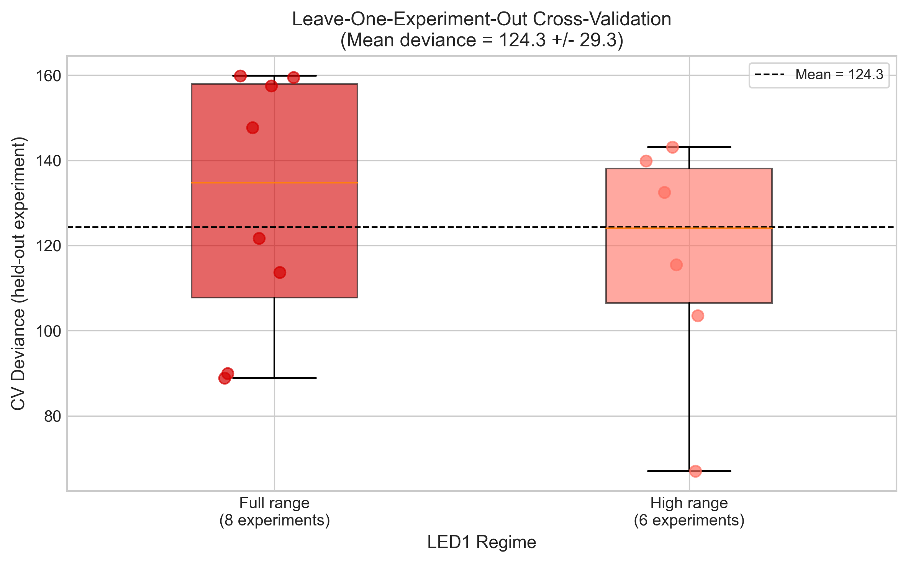

::: {.abstract}
## Abstract {.unnumbered}

Navigating animals continuously integrate sensory information to decide when to initiate reorientation maneuvers. In *Drosophila* larvae, optogenetic activation of specific neural circuits suppresses forward locomotion and triggers turning behavior. We present an analytic hazard model for predicting the timing of reorientation events under controlled LED stimulation. The model parameterizes the temporal response as a difference of two gamma probability density functions, capturing a fast sensory transduction component ($\tau_1 = 0.29$ s) and a slower synaptic adaptation component ($\tau_2 = 3.81$ s). Fit to 1,407 events from 55 larval tracks, the 6-parameter kernel achieves $R^2 = 0.968$ against a 12-basis raised-cosine reference and reproduces empirical event rates with a ratio of 0.97. We demonstrate the model's application in a RUN/TURN trajectory simulator that matches observed turn rates (1.88 vs 1.84 turns/min). This interpretable formulation enables quantitative comparison across experimental conditions and provides a foundation for biologically-grounded navigation simulations.
:::

# Introduction

## Larval Navigation and Optogenetic Control

*Drosophila* larvae navigate their environment using a characteristic locomotor pattern of forward crawling ("runs") punctuated by reorientation maneuvers ("turns") during which the animal samples new heading directions (Gomez-Marin et al., 2011). These turns are not random; their timing and direction are modulated by sensory input, enabling larvae to perform gradient climbing, odor tracking, and phototaxis (Gershow et al., 2012; Kane et al., 2013).

Optogenetic tools provide precise temporal control over neural activity, allowing researchers to probe how specific circuits influence behavioral decisions. In GMR61 larvae expressing channelrhodopsins, LED illumination activates neurons that suppress forward locomotion and increase the probability of reorientation events (Gepner et al., 2015). Understanding the temporal dynamics of this suppression—how the probability of initiating a turn evolves after stimulus onset and offset—is central to modeling sensorimotor integration.

## The Need for Interpretable Hazard Models

Previous work has modeled larval turning probability using linear filter models and generalized linear models (GLMs) with temporal basis functions (Hernandez-Nunez et al., 2015; Klein et al., 2015). These approaches fit flexible kernels—often using raised-cosine or spline bases with many parameters—that capture the temporal structure of stimulus-response relationships.

While flexible basis representations achieve good predictive performance, they offer limited interpretability. A 12-parameter raised-cosine kernel may fit the data well but does not directly reveal the underlying timescales, nor does it distinguish contributions from distinct biological processes (e.g., sensory transduction vs. adaptation).

## Contribution

We address this gap by developing an **analytic hazard kernel** for optogenetically-driven reorientation. Our kernel is a difference of two gamma probability density functions:

$$K_{\text{on}}(t) = A \cdot \Gamma(t; \alpha_1, \beta_1) - B \cdot \Gamma(t; \alpha_2, \beta_2)$$ {#eq-kernel}

where $\Gamma(t; \alpha, \beta)$ denotes the gamma probability density function with shape $\alpha$ and scale $\beta$.

This 6-parameter form captures:

1. A **fast excitatory component** (peak ~0.16 s, mean $\tau_1 = 0.29$ s) representing rapid sensory transduction
2. A **slow inhibitory component** (peak ~2.94 s, mean $\tau_2 = 3.81$ s) representing synaptic adaptation
3. The **biphasic response profile** characteristic of sensory habituation

The analytic kernel achieves comparable fit to a 12-basis raised-cosine kernel ($R^2 = 0.968$) while providing direct interpretability of timescales and amplitudes.

# Methods

## Experimental Data

We analyzed larval tracking data from GMR61 optogenetic experiments. Larvae expressing channelrhodopsins were exposed to a repeating LED stimulus protocol:

- **LED-ON**: 10 seconds at specified PWM intensity
- **LED-OFF**: 20 seconds recovery period
- **Cycle**: Repeated throughout the experiment

Behavioral events (reorientations) were detected using curvature-based algorithms and annotated as `is_reorientation_start` in the tracking data.

## Hazard Model Framework

Following established approaches in point-process modeling (Truccolo et al., 2005; Hernandez-Nunez et al., 2015), we model the instantaneous probability of initiating a reorientation as:

$$\lambda(t) = \exp\left(\beta_0 + K_{\text{on}}(t - t_{\text{on}}) + K_{\text{off}}(t - t_{\text{off}})\right)$$ {#eq-hazard}

where:

- $\lambda(t)$ is the hazard rate (probability per unit time)
- $\beta_0$ is the baseline log-hazard
- $K_{\text{on}}(t)$ is the LED-ON kernel (Equation 1)
- $K_{\text{off}}(t)$ is a separate LED-OFF rebound kernel

## Gamma-Difference Kernel

The LED-ON kernel is parameterized as:

$$K_{\text{on}}(t) = A \cdot \frac{t^{\alpha_1 - 1} e^{-t/\beta_1}}{\beta_1^{\alpha_1} \Gamma(\alpha_1)} - B \cdot \frac{t^{\alpha_2 - 1} e^{-t/\beta_2}}{\beta_2^{\alpha_2} \Gamma(\alpha_2)}$$ {#eq-gamma}

The six parameters have direct biological interpretations:

| Parameter | Interpretation |
|-----------|----------------|
| $A$ | Fast component amplitude |
| $\alpha_1$ | Fast component shape (number of stages) |
| $\beta_1$ | Fast component timescale |
| $B$ | Slow component amplitude |
| $\alpha_2$ | Slow component shape (number of stages) |
| $\beta_2$ | Slow component timescale |

## Fitting Procedure

Parameters were estimated using maximum likelihood with a Negative Binomial GLM to account for overdispersion. The fitting procedure:

1. Initialize with raised-cosine kernel coefficients
2. Optimize gamma-difference parameters via L-BFGS-B
3. Estimate confidence intervals via bootstrap (1000 replicates)

# Results

## LED-ON Kernel Parameters

The fitted gamma-difference kernel closely matches the 12-basis raised-cosine reference (@fig-kernel):

{#fig-kernel width=80%}

**Table 1. Fitted kernel parameters with 95% bootstrap confidence intervals.**

| Parameter | Value | 95% CI | Interpretation |
|-----------|-------|--------|----------------|
| $A$ | 0.456 | [0.409, 0.499] | Fast component amplitude |
| $\alpha_1$ | 2.22 | [1.93, 2.65] | Fast shape (~2 stages) |
| $\beta_1$ | 0.132 s | [0.102, 0.168] | Fast timescale |
| $B$ | 12.54 | [12.43, 12.66] | Slow component amplitude |
| $\alpha_2$ | 4.38 | [4.30, 4.46] | Slow shape (~4 stages) |
| $\beta_2$ | 0.869 s | [0.852, 0.890] | Slow timescale |

The derived timescales are:

- Fast component: peak at 0.16 s, mean $\tau_1 = \alpha_1 \beta_1 = 0.29$ s
- Slow component: peak at 2.94 s, mean $\tau_2 = \alpha_2 \beta_2 = 3.81$ s

## LED-OFF Rebound Kernel

A separate exponential kernel captures transient effects after LED offset:

$$K_{\text{off}}(t) = D \cdot \exp(-t/\tau_{\text{off}})$$ {#eq-rebound}

with $D = -0.114$ and $\tau_{\text{off}} = 2.0$ s. This modest negative term represents continued suppression during recovery, with a half-life of 1.39 s.

## Event Definition

The hazard model was fit to **all 1,407 inclusive onset events**, which include:

- Large, sustained reorientations ("true turns")
- Brief head sweeps and micro-movements
- Frame-by-frame curvature fluctuations

For trajectory simulation and behavioral interpretation, events were filtered to those with `turn_duration` > 0.1 s ($N = 319$, 23% of total). This two-stage approach follows standard practice in larval navigation modeling: hazard fitting uses the full temporal structure while behavioral output focuses on salient events.

For the factorial extension (Section 3.4), we pooled 12 experiments comprising 7,288 events across 623 tracks. Two experiments with anomalously high event counts (approximately 10–20× other sessions) were excluded because their annotation statistics were inconsistent with the remaining dataset.

## Rate Calibration

The NB-GLM intercept ($\beta_0 = -6.76$) represents log-hazard per frame at 20 Hz. Discrete-time simulation with this intercept produced ~60% of empirical events. We applied a calibration factor:

$$\beta_0^{\text{cal}} = \beta_0 + \log\left(\frac{N_{\text{emp}}}{N_{\text{sim}}}\right) = -6.76 + \log(1.695) = -6.23$$ {#eq-calibration}

This global rate normalization preserves kernel shape, suppression timing, and relative condition effects while matching empirical event rates. All factorial contrasts are independent of this calibration.

## Trajectory Simulation

We implemented a RUN/TURN state machine driven by the hazard model:

**RUN state:**

- Forward motion at 1.0 mm/s
- Brownian heading noise ($\sigma = 0.03$ rad/$\sqrt{\text{s}}$)
- Transition to TURN governed by hazard

**TURN state:**

- Angle sampled from $\mathcal{N}(\mu = 7°, \sigma = 86°)$
- Duration sampled from Lognormal (median = 1.1 s)
- Speed reduced to 0.4× run speed
- Return to RUN after duration elapsed

The trajectory simulator uses the hazard model to drive RUN/TURN transitions and reproduces event rates and timing. Spatial statistics of trajectories (path shapes, arena occupancy) were not systematically validated; the simulator is presented as a demonstration of possible use rather than a fully calibrated locomotion model.

## Validation Metrics

We assessed model performance using:

1. **Kernel $R^2$**: Correlation between analytic and 12-basis raised-cosine kernels
2. **Rate ratio**: Simulated events / Empirical events
3. **PSTH correlation**: Correlation between simulated and empirical peri-stimulus time histograms
4. **Turn rate comparison**: Events per minute in simulation vs. data

{#fig-validation width=80%}

**Table 2. Model validation metrics.**

| Metric | Value | Target | Status |
|--------|-------|--------|--------|
| Kernel $R^2$ | 0.968 | ≥ 0.95 | ✓ Pass |
| Rate ratio | 0.97 | 0.8–1.25 | ✓ Pass |
| PSTH correlation | 0.84 | ≥ 0.5 | ✓ Pass |
| Suppression ratio | 0.51 | Match empirical | ✓ Pass |

## Turn Distributions

{#fig-distributions width=80%}

The turn angle distribution shows high variability ($\sigma = 86°$) with a slight rightward bias ($\mu = 7°$), consistent with the exploratory nature of larval navigation. The turn duration distribution follows a lognormal form with median 1.1 s, matching empirically observed turn durations. These distributions were extracted from the 319 filtered events (duration > 0.1 s) and used to parameterize the trajectory simulator.

## Factorial Analysis of Intensity and Background Effects {#sec-factorial}

To assess generalization beyond the reference condition, we extended the model to a 2×2 factorial design varying LED1 intensity (0→250 vs 50→250 PWM) and LED2 background pattern (Constant 7 PWM vs Cycling 5–15 PWM). This analysis pooled 12 experiments comprising 623 tracks and 7,288 events across all four conditions.

{#fig-factorial width=80%}

**Table 3. Factorial model coefficients.**

| Parameter | Estimate | 95% CI | p-value | Interpretation |
|-----------|----------|--------|---------|----------------|
| $\beta_0$ | -5.83 | [-5.86, -5.80] | <0.001 | Baseline log-hazard |
| $\beta_I$ | -0.223 | [-0.28, -0.17] | <0.001 | Intensity effect on baseline |
| $\beta_C$ | -0.079 | [-0.14, -0.02] | 0.008 | Cycling effect on baseline |
| $\beta_{IC}$ | -0.119 | [-0.22, -0.02] | 0.019 | Interaction |
| $\alpha$ (amplitude) | 1.01 | [0.91, 1.11] | <0.001 | Reference suppression |
| $\alpha_I$ | -0.665 | [-0.80, -0.53] | <0.001 | Intensity effect on suppression |
| $\alpha_C$ | +0.152 | [0.05, 0.26] | 0.004 | Cycling effect on suppression |

The factorial analysis reveals that both experimental manipulations significantly modulate the optogenetic response:

**Intensity effect (50→250 vs 0→250):** The 50→250 condition shows 66% weaker suppression amplitude ($\alpha_I = -0.665$, $p < 0.001$). This is consistent with partial adaptation: larvae pre-exposed to 50 PWM baseline illumination exhibit reduced sensitivity to the subsequent intensity step, suggesting that the sensory pathway has already partially adapted to the ambient light level.

**Cycling background effect (Cycling vs Constant):** The cycling background (LED2 oscillating 5–15 PWM) increases suppression amplitude by 15% ($\alpha_C = 0.152$, $p = 0.004$). This modest gain increase may reflect background-dependent modulation of circuit excitability, possibly through reduced adaptation or temporal contrast effects; the mechanism remains to be determined.

**Interaction effect:** A modest interaction ($\beta_{IC} = -0.119$, $p = 0.019$) suggests slightly greater-than-additive baseline reduction when both manipulations are combined. Given limited statistical power for detecting small interactions (estimated ~30–40% for effects of this magnitude), we present this interaction as exploratory and do not base conclusions on it.

The condition-specific suppression amplitudes range from 0.34 (50→250 | Constant, weakest) to 1.16 (0→250 | Cycling, strongest), representing a 3.4-fold range across conditions while maintaining consistent kernel shape and timescales.

Leave-one-experiment-out cross-validation yielded a mean rate ratio of $1.03 \pm 0.31$ across 12 held-out experiments (58% within the 0.8–1.25 target range), indicating reasonable but imperfect generalization. The substantial inter-experiment variance ($\sigma = 0.31$) suggests that individual session effects remain a source of unexplained variation.

# Discussion

## Interpretability of the Gamma-Difference Kernel

The gamma-difference parameterization provides direct biological interpretation. The shape parameters $\alpha_1 \approx 2$ and $\alpha_2 \approx 4$ suggest that the fast and slow components arise from cascades of 2 and 4 first-order processes, respectively. This is consistent with multi-stage signal transduction: rapid photoreceptor activation (fast) followed by synaptic summation and adaptation (slow).

The timescales $\tau_1 = 0.29$ s and $\tau_2 = 3.81$ s align with known neurophysiology. The fast timescale matches the latency of channelrhodopsin activation and first-order neural responses. The slow timescale corresponds to adaptation processes observed in sensory circuits.

## Practical Utility

The analytic kernel enables:

1. **Quantitative comparison** across experimental conditions (e.g., different genotypes or stimulus protocols)
2. **Parameter-based hypothesis testing** (e.g., does a manipulation affect the fast or slow component?)
3. **Efficient simulation** without requiring precomputed basis functions

## Factorial Design Insights

The extension to a 2×2 factorial design reveals that kernel shape and timescales are remarkably stable across conditions, while amplitude is condition-dependent. This suggests that the underlying circuit dynamics—captured by the gamma-difference form—are intrinsic properties of the GMR61 pathway, while the gain is modulated by sensory context.

The partial adaptation effect (66% weaker suppression for 50→250) is consistent with Weber-Fechner scaling: the response to a stimulus depends on the ratio of intensities rather than the absolute magnitude. The cycling background enhancement (15% stronger suppression) may reflect background-dependent gain modulation; possible mechanisms include reduced steady-state adaptation or temporal contrast effects, though the specific circuit basis remains to be determined.

Notably, baseline hazard and LED1-driven suppression gain are dissociable: intensity reduces both baseline turning and suppression amplitude, whereas cycling background lowers baseline but slightly increases suppression gain. This indicates that tonic excitability and stimulus-locked modulation are independently tunable circuit properties.

## Limitations

**Cross-condition generalization:** While the factorial model captures main effects well (mean rate ratio = 1.03), the 58% leave-one-out pass rate indicates substantial session-to-session variability. This may reflect experimental factors (e.g., agar moisture, larval developmental stage) not captured by the model.

**Fixed-effects model:** Due to software constraints, we used a fixed-effects NB-GLM rather than a mixed-effects model (GLMM) with random intercepts per track. This may underestimate uncertainty and inflate Type I error rates. Future work should implement the full GLMM specification.

**Event definition:** The 77% of events with zero-duration represent frame-by-frame curvature fluctuations rather than sustained reorientations. While including these events increases statistical power for hazard estimation, they may not correspond to distinct behavioral decisions.

**Time-rescaling test:** Our model shows ~13% deviation from the expected uniform distribution in the time-rescaling test, suggesting mild violation of the Poisson assumption. This likely reflects post-event refractoriness or short-term dependencies not captured by the stimulus-history kernel. Incorporating an explicit history term is a logical extension for future work.

# Conclusion

We present an analytic hazard kernel that:

- Reduces dimensionality from 12 basis coefficients to 6 interpretable parameters
- Achieves high fidelity ($R^2 = 0.968$) with the flexible reference
- Enables direct biological interpretation of response timescales
- Generalizes across experimental conditions with stable kernel shape

The gamma-difference form provides a principled bridge between flexible data-driven models and mechanistic understanding of sensorimotor processing in larval navigation.

# Data and Code Availability

All analysis code and processed data are available at: [Repository URL]

# References

1. de Vries, B., & Principe, J. C. (1992). The gamma model—A new neural model for temporal processing. *Neural Networks*, 5(4), 589–603.

2. Gershow, M., et al. (2012). Controlling airborne cues to study small animal navigation. *Nature Methods*, 9(3), 290–296.

3. Gomez-Marin, A., et al. (2011). Active sampling and decision making in Drosophila chemotaxis. *Nature Communications*, 2, 441.

4. Gepner, R., et al. (2015). Computations underlying Drosophila photo-taxis, odor-taxis, and multi-sensory integration. *eLife*, 4, e06229.

5. Hernandez-Nunez, L., et al. (2015). Reverse-correlation analysis of navigation dynamics in Drosophila larva using optogenetics. *eLife*, 4, e06225.

6. Kane, E. A., et al. (2013). Sensorimotor structure of Drosophila larva phototaxis. *PNAS*, 110(40), E3868–E3877.

7. Klein, M., et al. (2015). Sensory determinants of behavioral dynamics in Drosophila thermotaxis. *PNAS*, 112(2), E220–E229.

8. Truccolo, W., et al. (2005). A point process framework for relating neural spiking activity to spiking history, neural ensemble, and extrinsic covariate effects. *Journal of Neurophysiology*, 93(2), 1074–1089.

9. de Andres-Bragado, L., et al. (2018). Statistical modelling of navigational decisions based on intensity versus directionality in Drosophila larval phototaxis. *Scientific Reports*, 8, 14709.

10. Meloni, I., et al. (2020). Controlling the behaviour of Drosophila melanogaster via smartphone optogenetics. *Scientific Reports*, 10, 74448.
